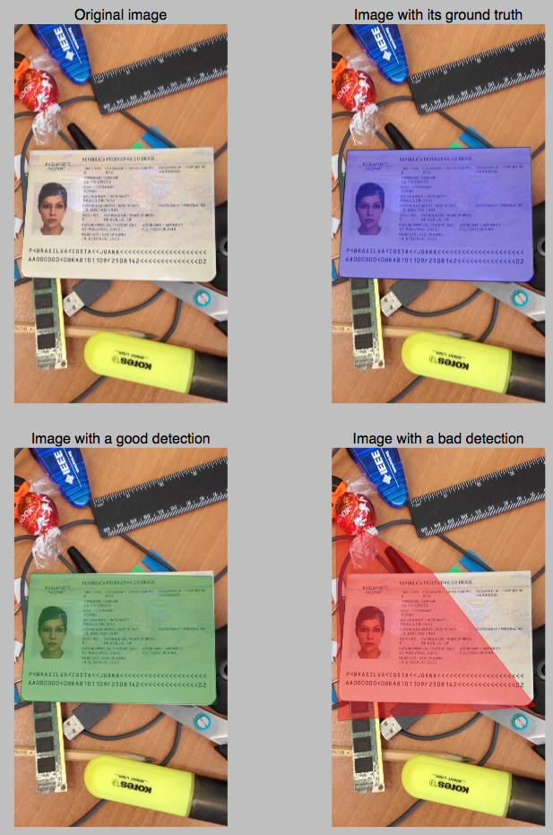

## Data Scientist - Test technique

**Disclaimer : Les données utilisées dans ce test sont factices**

### Objectif : Développer une solution de détourage de passeport.

### Résumé du test

L'objectif du test est de développer une solution de détection des coins du passeport dans une image. 

Le dataset est composé de 269 images. Le candidat est libre d'y ajouter des données externes et/ou faire de la data-augmentation.

Le dossier ground_truth contient l'annotation des coins du document selon le format suivant : 

```json
  {"quad": [["topleft"], ["topright"], ["bottomright"], ["bottomleft"]]}
```

Le candidat devra compléter le script evaluation.py permettant d'evaluer le modèle sur un dataset. La fonction devra prendre en entrée un dossier, structuré comme le dossier data, et devra retourner l'average precision du dataset.

Le candidat sera jugé sur la clarté, la qualité de code mais surtout sur la démarche entreprise pour résoudre le problème. 

Le langage **Python**(2.7 ou 3.6) et le framework **Tensorflow** sont imposés pour ce test technique.


### Structure du projet

```text
|-- data
|   |-- ground_truth
|   |-- images
|-- scripts
|   |-- evaluation.py (script à compléter)
|-- install
|   |-- Dockerfile (optionnel)
|   |-- build.sh (optionnel)
|-- run.sh
```

Récupération du projet: 
```bash
cd ~
git clone git@github.com:kuider/technical_test.git
```


Si besoin, le candidat pourra travailler dans un environnement dockerisé et y ajouter les dépendances. 

Build du projet : 
```bash
cd ~/technical_test/install
./build.sh
```

Lancer l'image docker
```bash
cd ~/technical_test/
./run.sh
```

NB: Si des difficultés de visionnages sous mac sont observées, le candidat peut convertir les images tiff en jpeg à l'aide de la librairie imagemagick

Commande d'installation d'imagemagick
```bash
brew install --with-libtiff imagemagick
```
Exemple de conversion en jpeg : 
```bash
convert toto.tif toto.jpeg
``` 


### Exemples de prédictions:

<div align="center">
  
</div>
